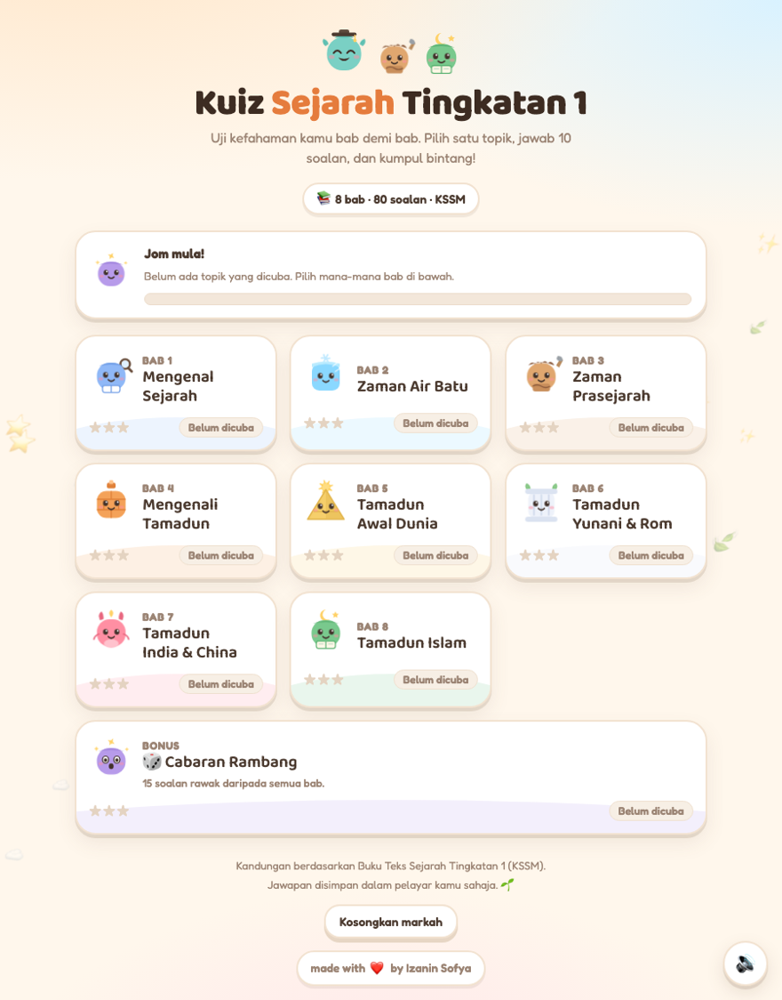
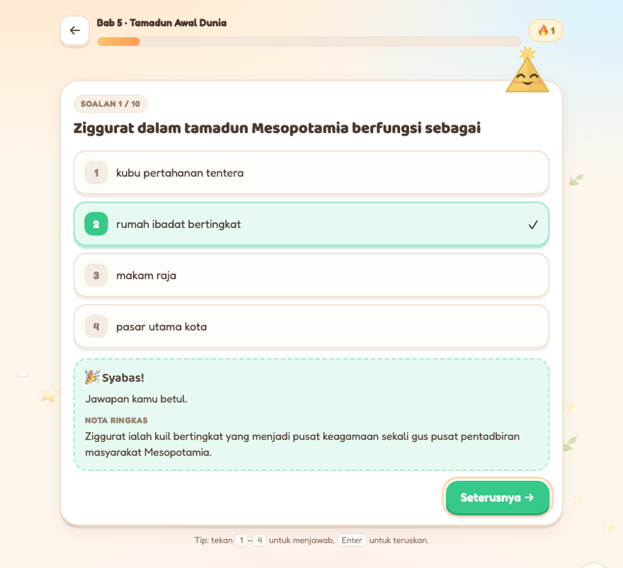

# Kuiz Sejarah Tingkatan 1

An interactive topical quiz for the Malaysian **Sejarah Tingkatan 1 (KSSM)** syllabus — 8 chapters, 80 questions, cute animated characters, and sound. Everything lives in **one `index.html` file**: no build step, no framework, no npm install, no backend.

Made for students to check their own understanding chapter by chapter, and built so that any teacher can swap in their own questions in about ten minutes.





---

## Contents

- [What's inside](#whats-inside)
- [Run it](#run-it)
- [Deploy it](#deploy-it)
- [Make it your own](#make-it-your-own)
  - [Edit the questions](#1-edit-the-questions)
  - [Add or remove a chapter](#2-add-or-remove-a-chapter)
  - [Change the characters](#3-change-the-characters)
  - [Change the colours and fonts](#4-change-the-colours-and-fonts)
  - [Change the wording / language](#5-change-the-wording--language)
  - [Tune the scoring, sounds and challenge](#6-tune-the-scoring-sounds-and-challenge)
  - [Use it for a different subject](#7-use-it-for-a-different-subject)
- [Check your work: the built-in self-test](#check-your-work-the-built-in-self-test)
- [How it works](#how-it-works)
- [Privacy](#privacy)
- [Browser support](#browser-support)
- [Ringkasan Bahasa Melayu](#ringkasan-bahasa-melayu)
- [Credits and licence](#credits-and-licence)

---

## What's inside

| | |
|---|---|
| **8 chapters** | Mengenal Sejarah · Zaman Air Batu · Zaman Prasejarah · Mengenali Tamadun · Tamadun Awal Dunia · Tamadun Yunani & Rom · Tamadun India & China · Tamadun Islam & Sumbangannya |
| **80 questions** | 10 per chapter — multiple choice and *betul/salah*, each with a short explanation shown after answering |
| **Cabaran Rambang** | A bonus round of 15 random questions drawn from every chapter |
| **10 characters** | Hand-drawn inline SVG mascots that bob, blink, jump when you're right and shed a tear when you're wrong |
| **Sound** | Synthesised with the Web Audio API — a rising arpeggio for correct, a soft descending swoop for wrong, a fanfare when a chapter is finished. Toggle with the 🔊 button |
| **Confetti** | Fires every time a chapter is completed, with extra waves above 80% and at a perfect score |
| **Progress** | Best score and 1–3 stars per chapter, saved in the browser |
| **Keyboard** | `1`–`4` to answer, `Enter` to continue |
| **Accessibility** | Focus rings, `aria-live` feedback, and full `prefers-reduced-motion` support |
| **Self-test** | 170 built-in assertions — open with `?selftest=1` |

---

## Run it

Download or clone the repo and **double-click `index.html`**. That's it — it runs straight from your hard drive, offline, with no server.

```bash
git clone https://github.com/IzaninSofya/kuiz-sejarah-t1.git
cd kuiz-sejarah-t1
open index.html          # macOS   (Windows: start index.html  ·  Linux: xdg-open index.html)
```

If you'd rather serve it locally while editing:

```bash
python3 -m http.server 8000
```

Then open <http://localhost:8000>.

---

## Deploy it

The whole site is one file, so every static host works. Pick one:

**Netlify — drag and drop (easiest, no account setup)**

1. Go to <https://app.netlify.com/drop>
2. Drag the **`kuiz-sejarah-t1` folder** onto the page (the folder, not the file)
3. You get a live URL in seconds. Rename the site in *Site settings → Change site name*.

**Netlify — from GitHub (auto-deploys on every push)**

1. *Add new site → Import an existing project → GitHub*, then pick your repo
2. **Build command:** leave empty · **Publish directory:** `.`
3. Deploy. Every `git push` republishes it.

**GitHub Pages**

Push the repo, then *Settings → Pages → Source: Deploy from a branch → `main` / `/ (root)`*. Live at `https://<your-username>.github.io/kuiz-sejarah-t1/`.

**Vercel / Cloudflare Pages**

Import the repo, leave the build command empty, set the output directory to `.`.

---

## Make it your own

Open `index.html` in any editor. The JavaScript is split into eight clearly labelled sections — search for these comment headers to jump around:

```
1. WATAK COMEL      the SVG characters
2. BANK SOALAN      the question bank      ← you'll spend most of your time here
3. ENJIN KUIZ       storage, stars, confetti, sound
4. SKRIN UTAMA      the topic grid
5. KUIZ             question rendering and answer handling
6. KEPUTUSAN        the results screen
7. KAWALAN          buttons and keyboard
8. UJIAN KENDIRI    the self-test
```

### 1. Edit the questions

All 80 questions live in one array called `TOPICS`, under **`2. BANK SOALAN`**. Each question is four short keys:

```js
{ s:'Siapakah tokoh yang digelar <b>Bapa Sejarah</b>?',   // s = soalan   (the question)
  p:['Aristotle','Herodotus','Hippocrates','Homer'],      // p = pilihan  (the options)
  j:1,                                                    // j = jawapan  (index of the correct one)
  n:'Herodotus, sejarawan Yunani, digelar Bapa Sejarah…' } // n = nota    (shown after answering)
```

Four rules, all of them enforced by the self-test:

- **`j` counts from zero.** `j:0` is the first option, `j:1` the second, and so on. This is the single easiest thing to get wrong.
- **`p` takes 2 to 4 options.** Use exactly two — `['Betul','Salah']` — for a true/false question.
- **`n` is required** and should actually explain the answer; it's the part that teaches.
- **`s` may contain simple HTML** such as `<b>bold</b>` or `<i>italic</i>`. Keep tags balanced.

To add a question, copy any existing block and paste it inside that chapter's `soalan:[ … ]` array, separated by a comma. To delete one, remove the whole `{ … }` block and its trailing comma. Chapters don't have to hold exactly ten questions — the quiz counts whatever it finds.

> Watch out for apostrophes: the strings are wrapped in single quotes, so write `d\'Orsay` or switch that string to double quotes.

### 2. Add or remove a chapter

Each chapter is one object in `TOPICS`:

```js
{
  id:'b9',                       // unique, short, no spaces — used as the storage key
  bab:'Bab 9',                   // small label on the card
  nama:'Kesultanan Melayu Melaka', // chapter title
  pendek:'Melaka',               // optional: shorter title, used on the card when the full one is long
  mascot:'naga',                 // one of the character keys below
  warna:'#ff8fa3',               // the card's colour wash
  intro:'Kebangkitan dan kejatuhan Melaka.',
  soalan:[ /* your questions */ ]
}
```

Delete a chapter by removing its whole object. The home grid, the progress bar, the random challenge and the self-test all count chapters dynamically, so nothing else needs touching.

### 3. Change the characters

Set a chapter's `mascot` to any of these keys:

| Key | Character | Key | Character |
|---|---|---|---|
| `cikgu` | teacher with a mortarboard | `piramid` | pyramid |
| `buku` | detective with a magnifying glass | `tiang` | Greek column |
| `ais` | ice cube | `naga` | dragon |
| `gua` | cave dweller | `bintang` | star and book |
| `bata` | brick | `campur` | sparkle (used by the bonus round) |

To draw a new one, add an entry to `MASCOTS` under **`1. WATAK COMEL`**. Each character is three optional SVG layers on a `0 0 100 100` canvas — `back` (behind the body), `body`, and `front` (in front) — and the face is drawn automatically on top:

```js
kucing: { c:'#ffd166', dy:0,
  back:'<path d="M28 26 l-4 -16 14 8z" fill="#e8b93d"/>',   // an ear
  body:'<rect x="17" y="24" width="66" height="63" rx="29" fill="#ffd166"/>',
  front:'' }
```

`dy` nudges the face down in SVG units if your body sits low — the pyramid uses `dy:8`. The four expressions (`idle`, `happy`, `sad`, `wow`) are generated for you by the `face()` function, so you never draw eyes yourself.

### 4. Change the colours and fonts

Every colour is a CSS custom property in the `:root` block at the top of the file:

```css
--paper:#fff7ec;   /* page background   */
--ink:#4b3a2f;     /* body text         */
--brand:#ff9a5a;   /* buttons, accents  */
--good:#37c98a;    /* correct answers   */
--bad:#ff6b81;     /* wrong answers     */
--gold:#ffc53d;    /* stars             */
--r:24px;          /* corner rounding   */
```

The fonts are **Fredoka** and **Baloo 2** from Google Fonts. Swap the `<link>` in `<head>` and the `--font` variable to change them — the stack already falls back to rounded system fonts if the network is unavailable, so the page never loses its character offline.

### 5. Change the wording / language

The interface is in Bahasa Melayu. All of it is plain strings in the HTML body and in sections 4–6 — there's no translation layer to fight. The main ones: the `<h1>` and `.sub` in the home screen, the praise and encouragement arrays (`pujian`, `sokong`) in `jawab()`, and the five score bands (`tajuk` / `kata`) in `paparKeputusan()`.

### 6. Tune the scoring, sounds and challenge

| What | Where | Default |
|---|---|---|
| Star thresholds | `bintangUntuk()` | ★★★ ≥ 90% · ★★ ≥ 70% · ★ ≥ 50% |
| Bonus round length | `MIX.jumlah` | `15` questions |
| Sound on/off default | `bunyiHidup` | on, remembered per browser |
| Note pitches | `bunyiBetul()` / `bunyiSalah()` / `bunyiSiap()` | C–E–G–C rising, G→C falling, five-note fanfare |
| Confetti intensity | `raikan()` | 48 pieces, plus waves at 80% and 100% |

Sounds are generated by oscillators at runtime, so there are no audio files to host and nothing to load.

### 7. Use it for a different subject

Nothing in the engine knows anything about history. To turn it into a Geografi, Sains or Bahasa quiz:

1. Replace the contents of `TOPICS` with your own chapters and questions (section 2).
2. Point each chapter at a `mascot` and a `warna` you like, or draw new characters (section 3).
3. Update the `<title>`, the `<h1>`, the `.sub` line and the `8 bab · 80 soalan · KSSM` pill.
4. Run the self-test and fix anything it flags.

Steps 1 and 4 are the real work. Everything else is cosmetic.

---

## Check your work: the built-in self-test

This is the part worth knowing about if you're editing questions. Open the page with `?selftest=1` on the end of the URL:

```
index.html?selftest=1
```

A dark panel appears at the top of the page listing every check. It runs **170 assertions**, including:

- every question has valid text, 2–4 non-empty options, a correct-answer index that's actually in range, and an explanation
- no duplicated questions, no duplicated options within a question, no unbalanced `<b>` or `<i>` tags
- answers aren't all sitting in the same position within a chapter
- every character generates valid SVG in all four expressions
- a simulated playthrough of every chapter, answering all-correct (expects full marks) and all-wrong (expects zero)
- best scores save and never decrease, star thresholds are right, keyboard input works, the sound toggle flips and mutes properly, confetti fires on completion

**If you add or edit questions, run this before you deploy.** A mistyped `j` index — a question whose "correct" answer is wrong — is invisible by eye and obvious to the self-test.

To check it from the command line, for example in CI:

```bash
"/Applications/Google Chrome.app/Contents/MacOS/Google Chrome" \
  --headless --disable-gpu --virtual-time-budget=9000 \
  --dump-dom "file://$PWD/index.html?selftest=1" 2>/dev/null \
  | grep -o 'SELFTEST_RESULT[^<]*' | head -1
```

Expected output:

```
SELFTEST_RESULT: PASS 170/170  (semua lulus)
```

The number grows as you add questions — what matters is `PASS` and that no line says `FAIL`.

---

## How it works

```
kuiz-sejarah-t1/
├── index.html      the entire application — markup, styles, logic, questions, characters
├── README.md       this file
└── docs/           screenshots used above (not needed to run the quiz)
```

No dependencies, no build tooling, no tracking, no analytics. The only network request the page makes is to Google Fonts for the two rounded typefaces, and it renders correctly without them. Characters are inline SVG, the confetti is DOM elements with a CSS keyframe, and the sounds are Web Audio oscillators — so there are no images, icon fonts or audio files to go missing.

## Privacy

Scores are kept in the browser's `localStorage` under `sejarahT1_kuiz_v1` (best score and attempts per chapter) and `sejarahT1_bunyi` (the sound preference). Nothing is sent anywhere, there's no account and no server. Students clear their own scores with the **Kosongkan markah** button. Every storage call is wrapped in `try/catch`, so the quiz still works in private-browsing mode where storage is blocked.

## Browser support

Any current Chrome, Edge, Firefox or Safari, on desktop or phone. The layout is responsive down to small phone widths. Sound needs the Web Audio API — available everywhere current — and first plays on a tap, which satisfies browser autoplay rules. Animations respect the operating system's "reduce motion" setting.

---

## Ringkasan Bahasa Melayu

**Kuiz Sejarah Tingkatan 1 (KSSM)** — 8 bab, 80 soalan, satu fail `index.html` sahaja. Tiada pemasangan, tiada pelayan, boleh dibuka terus daripada komputer atau dihoskan percuma di Netlify atau GitHub Pages.

**Untuk guru yang mahu menggunakannya untuk subjek sendiri:**

1. Buka `index.html` dengan mana-mana editor teks dan cari bahagian **`2. BANK SOALAN`**.
2. Setiap soalan ada empat kunci: `s` (soalan), `p` (pilihan), `j` (nombor jawapan betul, **bermula dari 0**) dan `n` (nota penerangan).
3. Salin mana-mana blok soalan sedia ada, ubah isinya, dan simpan.
4. Buka semula fail itu dengan `?selftest=1` di hujung URL untuk memastikan tiada kesilapan — panel hitam di atas akan memaparkan `PASS` jika semuanya betul.

Markah pelajar disimpan dalam pelayar mereka sendiri sahaja; tiada data dihantar ke mana-mana.

---

## Credits and licence

made with ❤️ by **Izanin Sofya**

The questions were written from scratch against the **Sejarah Tingkatan 1 KSSM** syllabus and the Ministry of Education's [digital textbook listing](https://sites.google.com/moe-dl.edu.my/bidang-kemanusiaan-sebaru/panitia-sejarah/buku-teks-digital). No text is reproduced from the textbook — the questions and explanations are original wording covering the same syllabus content. Verify against the current textbook before classroom use, since syllabus details are revised from time to time.

If you do reuse or adapt this, a link back is appreciated but not required. If you build a version for another subject, I'd love to see it.
